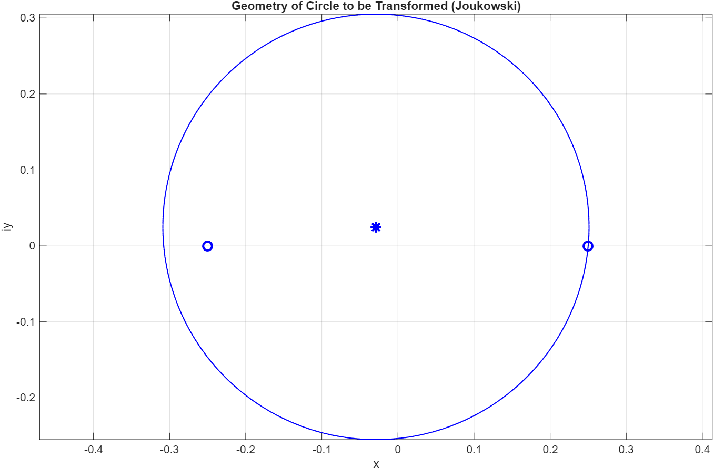
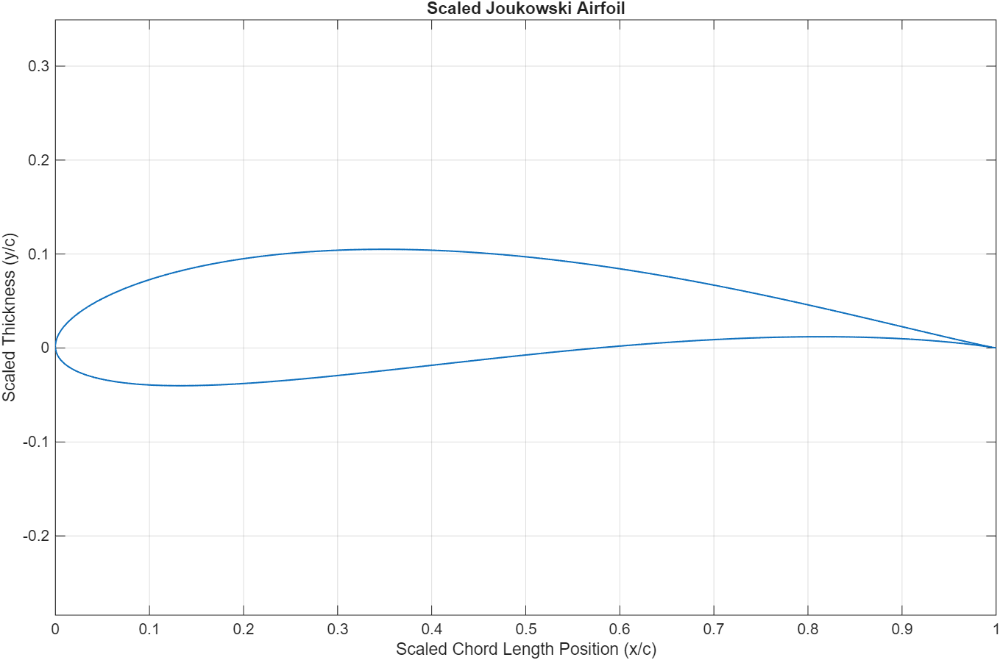
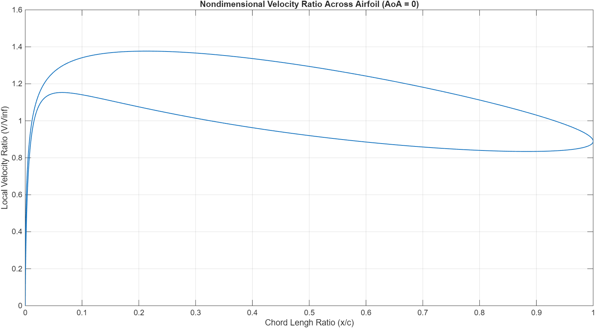
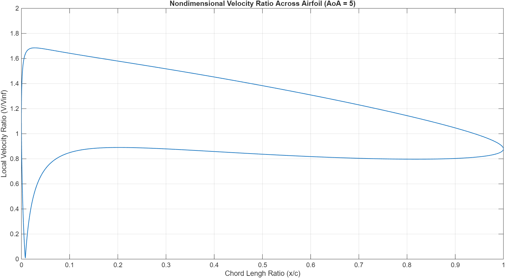
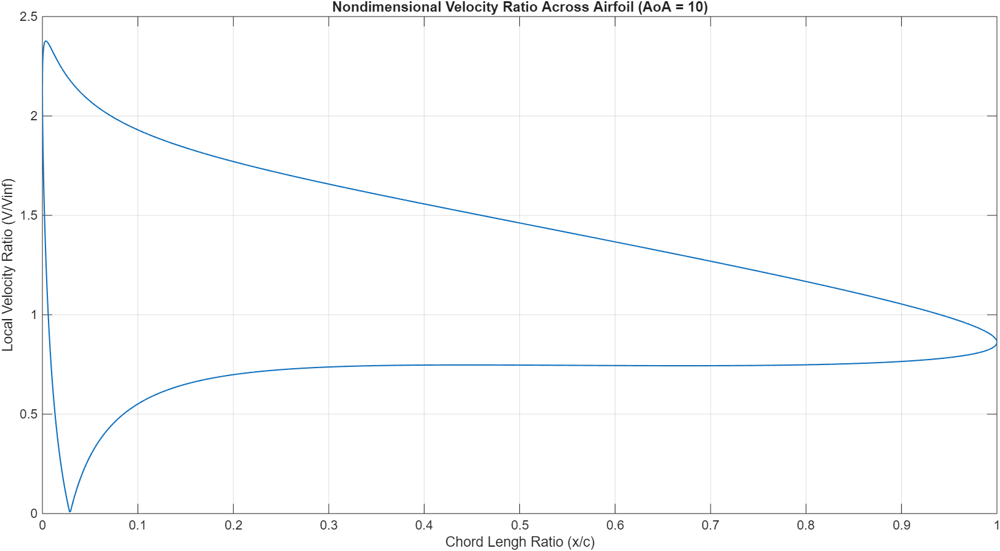
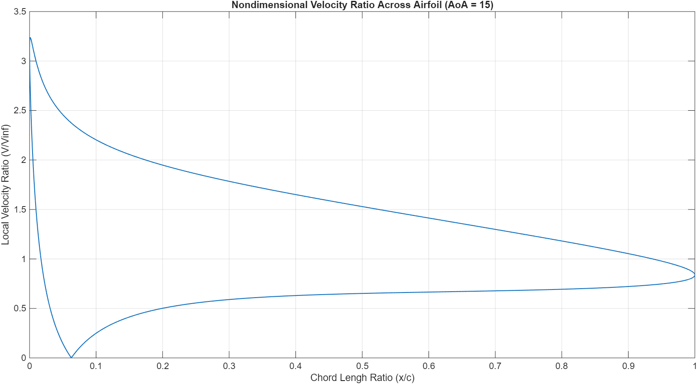
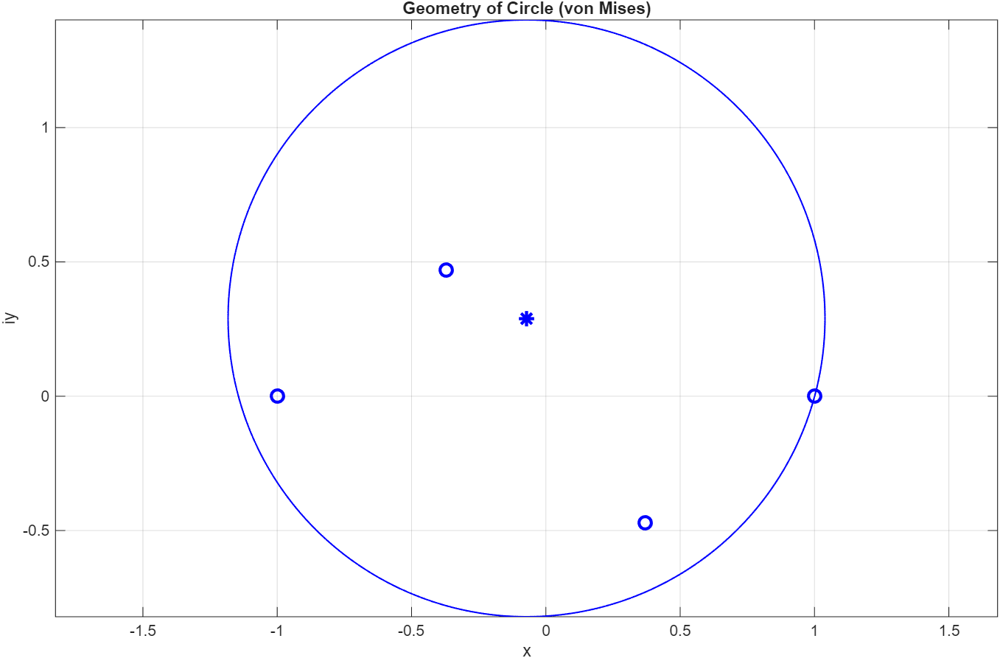
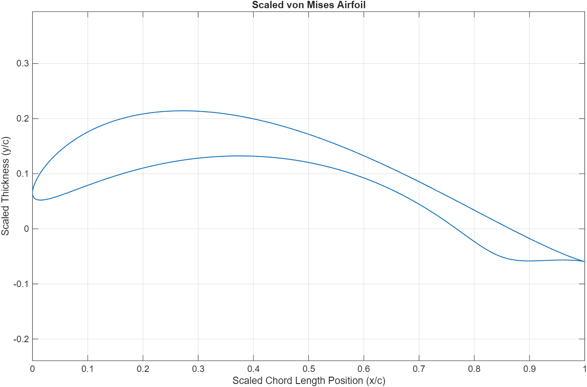

# Joukowski Airfoil Transformation (MATLAB)

## Overview
Developed a MATLAB simulation tool to generate airfoil geometries 
via Joukowski transformations applied to circular cylinders in the 
complex plane. Validated results against XFOIL to assess the 
accuracy of potential flow assumptions.

## Tools & Methods
- MATLAB
- Joukowski conformal mapping
- Potential flow theory
- Complex plane analysis
- XFOIL validation

## Key Results
- Generated nondimensional velocity distributions (V/V∞) across 
  airfoil surfaces with numerically stable trailing-edge handling
- Conducted parametric studies across AoA from 0° to 15°
- Visualized flow field evolution and surface velocity profiles
- Identified divergence from XFOIL predictions beyond 10° AoA 
  due to boundary layer separation

## Figures

### Circle Geometry

### Airfoil Geometry

### Velocity Distribution at AoA 0°

### Velocity Distribution at AoA 5°

### Velocity Distribution at AoA 10°

### Velocity Distribution at AoA 15°

### Von Mises Circle

### Von Mises Airfoil

## Report
[View Full Report](von_Mises_Project_Report_Final.pdf)
